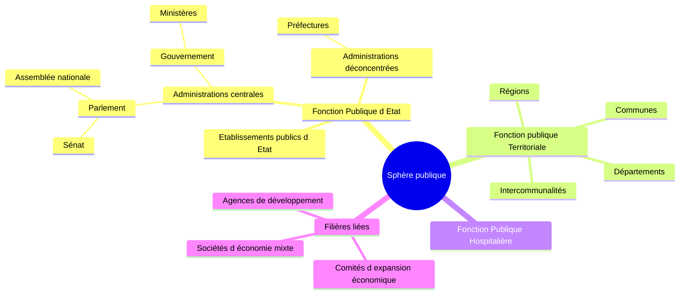

# ProgNum/Public - Le numérique au service de la sphère publique
🚧 Travail en cours, voir la [liste de tâches](https://github.com/users/HubTou/projects/2)

## La Sphère publique ?
Parmi les leviers majeurs pour la réduction de la dette publique et du déficit budgétaire
on peut probablement citer la mutualisation des moyens numériques (personnels, budgets, équipements, solutions logicielles, etc.)
et la transformation digitale de l'offre de services de la sphère publique.

Du coup, qu'entend-on par sphère publique ?

