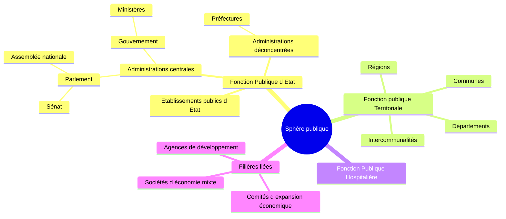

# ProgNum/Public - Le numérique au service du secteur public
🚧 Travail en cours, voir la [liste de tâches](https://github.com/users/HubTou/projects/2)

## Le secteur public ?
Parmi les leviers majeurs pour la réduction de la dette publique et du déficit budgétaire
on peut probablement citer la mutualisation des moyens numériques (personnels, budgets, équipements, solutions logicielles, etc.)
et la transformation digitale de l'offre de services du secteur public.

Du coup, qu'entend-on par [secteur public](https://fr.wikipedia.org/wiki/Secteur_public_en_France), puisque celui-ci va bien au-delà de l'[administration publique](https://fr.wikipedia.org/wiki/Administration_publique_fran%C3%A7aise) ?

```mermaid
mindmap
  root((Sphère publique))
    Fonction Publique d Etat
      Administrations centrales
        Parlement
          Assemblée nationale
          Sénat
        Gouvernement
          Ministères
      Administrations déconcentrées
        Préfectures
      Etablissements publics d Etat
    Fonction publique Territoriale
      Régions
      Départements
      Communes
      Intercommunalités
    Fonction Publique Hospitalière
    Filières liées
      Sociétés d économie mixte
      Comités d expansion économique
      Agences de développement
```

## Quelle est la situation actuelle ?
Difficile de proposer quelque chose de pertinent sans savoir quel est notre point de départ !

Pour cela nous pouvons nous appuyer sur différentes sources, par lesquelles :
* les rapports de la [Cour des comptes](https://www.ccomptes.fr/fr), notamment [ceux sur le numérique](https://www.ccomptes.fr/fr/recherche?search=num%C3%A9rique&sort_by=search_api_relevance&items_per_page=10&f%5B0%5D=daterange%3A2017-0&f%5B1%5D=daterange%3A2018&f%5B2%5D=daterange%3A2019&f%5B3%5D=daterange%3A2020&f%5B4%5D=daterange%3A2021&f%5B5%5D=daterange%3A2022&f%5B6%5D=daterange%3A2023&f%5B7%5D=daterange%3A2024&f%5B8%5D=institution%3A98&f%5B0%5D=daterange%3A2017-0&f%5B1%5D=daterange%3A2018&f%5B2%5D=daterange%3A2019&f%5B3%5D=daterange%3A2020&f%5B4%5D=daterange%3A2021&f%5B5%5D=daterange%3A2022&f%5B6%5D=daterange%3A2023&f%5B7%5D=daterange%3A2024&f%5B8%5D=institution%3A98&f%5B0%5D=daterange%3A2017-0&f%5B1%5D=daterange%3A2018&f%5B2%5D=daterange%3A2019&f%5B3%5D=daterange%3A2020&f%5B4%5D=daterange%3A2021&f%5B5%5D=daterange%3A2022&f%5B6%5D=daterange%3A2023&f%5B7%5D=daterange%3A2024&f%5B8%5D=institution%3A98&f%5B0%5D=daterange%3A2017-0&f%5B1%5D=daterange%3A2018&f%5B2%5D=daterange%3A2019&f%5B3%5D=daterange%3A2020&f%5B4%5D=daterange%3A2021&f%5B5%5D=daterange%3A2022&f%5B6%5D=daterange%3A2023&f%5B7%5D=daterange%3A2024&f%5B8%5D=institution%3A98&f%5B0%5D=daterange%3A2017-0&f%5B1%5D=daterange%3A2018&f%5B2%5D=daterange%3A2019&f%5B3%5D=daterange%3A2020&f%5B4%5D=daterange%3A2021&f%5B5%5D=daterange%3A2022&f%5B6%5D=daterange%3A2023&f%5B7%5D=daterange%3A2024&f%5B8%5D=institution%3A98&f%5B0%5D=daterange%3A2017-0&f%5B1%5D=daterange%3A2018&f%5B2%5D=daterange%3A2019&f%5B3%5D=daterange%3A2020&f%5B4%5D=daterange%3A2021&f%5B5%5D=daterange%3A2022&f%5B6%5D=daterange%3A2023&f%5B7%5D=daterange%3A2024&f%5B8%5D=institution%3A98) ou [ceux sur les Systèmes d'Information](https://www.ccomptes.fr/fr/recherche?f%5B0%5D=date%3A2017-0&f%5B1%5D=date%3A2018&f%5B2%5D=date%3A2019&f%5B3%5D=date%3A2020&f%5B4%5D=date%3A2021&f%5B5%5D=date%3A2022&f%5B6%5D=date%3A2023&f%5B7%5D=date%3A2024&items_per_page=10&search=syst%C3%A8mes%20d%27information&sort_by=search_api_relevance) parmi lesquels :
  * [Le pilotage de la transformation numérique de l’État par la direction interministérielle du numérique](https://www.ccomptes.fr/fr/publications/le-pilotage-de-la-transformation-numerique-de-letat-par-la-direction) du 10-07-2024
  * [La mutualisation des systèmes d’information du service des retraites de l’État et de la Caisse des dépôts et consignations](https://www.ccomptes.fr/fr/publications/la-mutualisation-des-systemes-dinformation-du-service-des-retraites-de-letat-et-de-la) du 20-06-2023
  * [La stratégie nationale de recherche en intelligence artificielle](https://www.ccomptes.fr/fr/publications/la-strategie-nationale-de-recherche-en-intelligence-artificielle) du 03-04-2023
  * [La mise en œuvre du programme d’investissement d’avenir](https://www.ccomptes.fr/fr/publications/la-mise-en-oeuvre-du-programme-dinvestissement-davenir) du 27-10-2021
  * [La conduite des grands projets numériques de l'État](https://www.ccomptes.fr/fr/publications/la-conduite-des-grands-projets-numeriques-de-letat) du 14-10-2020
  * [Le service public numérique pour l’éducation]( https://www.ccomptes.fr/fr/publications/le-service-public-numerique-pour-leducation) du 08-07-2019
  * [Les systèmes d’information de la DGFiP et de la DGDDI](https://www.ccomptes.fr/fr/publications/les-systemes-dinformation-de-la-dgfip-et-de-la-dgddi) du 28-05-2019
  * [Le programme Sirhen](https://www.ccomptes.fr/fr/publications/le-programme-sirhen) du 06-03-2017
  * [Les données personnelles de santé gérées par l’assurance maladie](https://www.ccomptes.fr/fr/publications/les-donnees-personnelles-de-sante-gerees-par-lassurance-maladie) du 03-05-2016
  * [Relations aux usagers et modernisation de l’État](https://www.ccomptes.fr/fr/publications/relations-aux-usagers-et-modernisation-de-letat) du 04-02-2016
  * [La masse salariale de l’État : enjeux et leviers](https://www.ccomptes.fr/fr/publications/la-masse-salariale-de-letat-enjeux-et-leviers) du 09-09-2015
  * [Le coût du dossier médical personnel depuis sa mise en place](https://www.ccomptes.fr/fr/publications/le-cout-du-dossier-medical-personnel-depuis-sa-mise-en-place) du 19-02-2013
* les rapports du [Sénat](https://www.senat.fr/), notamment [ceux sur le numérique](https://www.senat.fr/basile/rechercheRapport.do?rch=rs&aff=ens&rch=gs&de=20041019&au=20241019&rqg=r&dp=20+ans&radio=dp&aff=sep&tri=p&off=0&afd=ppr&afd=ppl&afd=pjl&afd=cvn&_c=num%C3%A9rique) ou [ceux sur les Systèmes d'Information](https://www.senat.fr/basile/rechercheRapport.do?idRecherche=-61859efc%3A192a3937160%3A-4fd&unk=syst%C3%A8mes+d%27information&dp=20+ans&de=19%2F10%2F2004&au=19%2F10%2F2024&action=Lancer+la+recherche&rch=rs&aff=ens), parmi lesquels :
  * [Rapport d'information fait au nom de la commission des finances sur la Direction interministérielle du numérique et du système d’information et de communication de l’État](https://www.senat.fr/rap/r16-076/r16-0761.pdf) du 26-10-2016
* quelques articles de presse :
  * [L'informatique d'Etat emploie en moyenne 2 500 prestataires](https://www.silicon.fr/Thematique/actualites-1367/Breves/L-informatique-d-Etat-emploie-en-moyenne-2-500-prestataires-439587.htm) du 02-03-2021
  * [Jacques Marzin, DSI de l'Etat : « moins de 20 datacenters pour l'ensemble de l'Etat »](https://www.silicon.fr/Thematique/actualites-1367/Breves/Jacques-Marzin-DSI-de-l-Etat-moins-de-20-datacenters-456390.htm) du 28-05-2014
* ou encore des données disponibles sur la [Plateforme ouverte des données publiques françaises](https://www.data.gouv.fr/fr/), notamment [ceux sur le numérique](https://www.data.gouv.fr/fr/datasets/?q=num%C3%A9rique) ou [ceux sur les Systèmes d'Information](https://www.data.gouv.fr/fr/datasets/?q=syst%C3%A8mes+d%27information)
